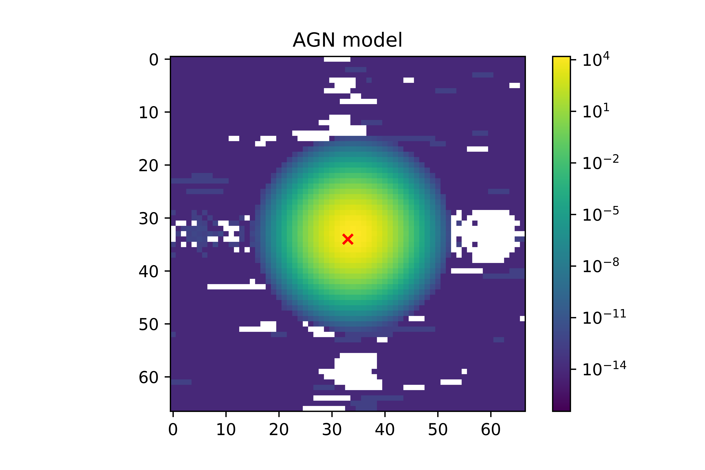
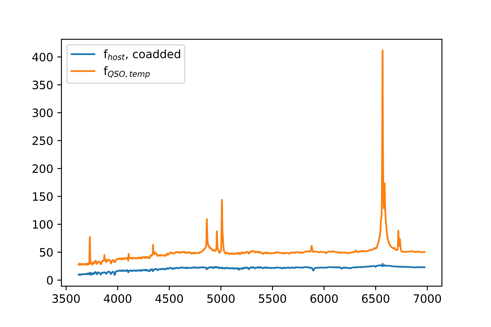

# AGN Subtraction

A repository to investigate the best way to quickly and painlessly model the multiwavelength PSF of an AGN in IFS data. The current method is to use the brightest spaxel, which is assumed to be dominated by the AGN. Then, I use an iterative MCMC code to determine the best fit template stellar component, which is a line multiplied by a template spectrum. After subtracting this off from the central spaxel, I have the 'pure' AGN spectrum, which I convolve with a spatial PSF to match that of the seeing and then subtract off of all spaxels.

The output is a .fits file of the AGN-subtracted cube, which can then be fit with ppxf.
 